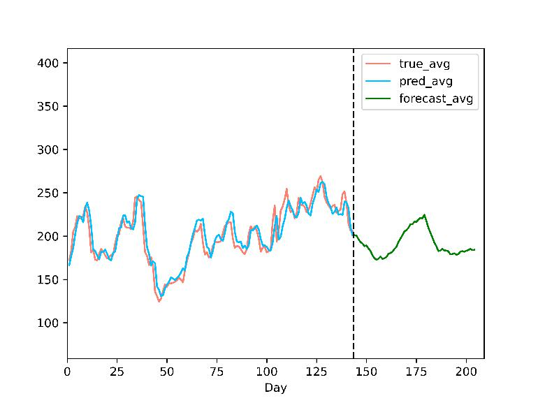

[English](README.md) | [中文](README_zh.md)

## What is this?

This is the freshman year project for HITSZ 2020-2021. We chose the topic "Stock Prediction and Analysis based on Machine Learning."

In essence, the core of this project is our introduction to deep learning and an attempt at the complete workflow of an engineering project. In both respects, the project has achieved its initial objectives.

The project is divided into two main parts: the implementation of the GUI and the implementation of various model algorithms. The bridge between the two is the Config class, which encapsulates all the required parameters for the GUI to call the models.

> We learned the encapsulation strategy from here: [https://github.com/hichenway/stock_predict_with_LSTM/blob/master/main.py](https://github.com/hichenway/stock_predict_with_LSTM/blob/master/main.py)

The GUI was completed by zh and wyl, while I was responsible for the model codes. yzx took care of the initial web scraping and later worked on the initial project process as well as model adjustments in collaboration with me.

## What can this project do?

We believe our models, when trained properly, can effectively learn most stock trends. Even if they predict the exact opposite trend for a few stocks, we think this issue can be addressed with a more detailed analysis model.

Predicting complex stock prices using a single neural network model with historical data is feasible. It suggests that, despite the influence of various factors, stocks exhibit certain regularities over time.

The direction of normalization has a significant impact on model weight learning. Our unconventional data normalization approach avoids potential data leakage issues and seamlessly transitions to iterative prediction data processing.

Combining iterative prediction with follow-up prediction can, to some extent, eliminate unsuitable models. A typical problem is models learning to use the previous day's price as the current day's output, causing lag. Iterative prediction helps determine if the function learned by the model is correct.

## Project Introduction

### Project Results Display

The images show NVAX results (for more results, check the `assets` folder):

### Overall Project Structure

For the framework code, the GUI framework uses the wxPython library, and there was no special discussion about the choice of library. The GUI code serves as the main module of the entire project, invoking and organizing other parts.

Regarding data acquisition, since YahooFinance is a dynamic web page, the selenium library is known to scrape such pages. A major downside is its slow speed and high network requirements. For stock data updates, the original web scraper search function was modified to use the official API for more efficient handling; web scraping is only used when searching for unknown stock abbreviations, improving efficiency.

Regarding data processing and analysis, the data processing method directly affects model learning outcomes (Normalization direction and strategy). Common underfitting and overfitting outcomes were observed, involving some parameter tuning and classic deep learning optimization techniques. We analyzed the reliability of the results and obtained some highly reliable models, investing more research effort into some intriguing phenomena.

### Limitations during the Project Execution

1. For individual developers, there's no full support for the GUI interface; there's a dependence on the source code and the console.
2. The data source requires a robust internet connection, both when using the API or invoking the web scraper (being able to smoothly access GitHub is a basic requirement).
3. Specific ways of analyzing model details remain unclear. While standard image processing can be explained using methods like the Saliency Map, judging the outcomes of stock predictions, which are challenging even for experts, is more difficult.
4. The originally planned classification model was abandoned. We suspect that the somewhat arbitrary classification of rises and falls might lead to model learning failures. This is still under investigation.

### References

[1] 7forz. 2019. Predicting time series using LSTM. https://www.7forz.com/3319/.

[2] Jimmy Lei Ba, Jamie Ryan Kiros, and Geoffrey E. Hinton. 2016. Layer normalization.

[3] Sergey Ioffe and Christian Szegedy. 2015. Batch normalization: Accelerating deep network training by reducing internal covariate shift.

[4] Yuxin Wu and Kaiming He. 2018. Group normalization.

[5] Zhang Feng. 2015. Understanding HMM (Hidden Markov Model). https://www.cnblogs.com/skyme/p/4651331.html.

[6] Programmer One One Dis. 2020. Time series prediction with Python Part Four: Stationary/Non-stationary time series. https://cloud.tencent.com/developer/article/1638198.

[7] Fat House_Sean. 2018. Stock prediction using LSTM. https://blog.csdn.net/a19990412/article/details/85139058.
