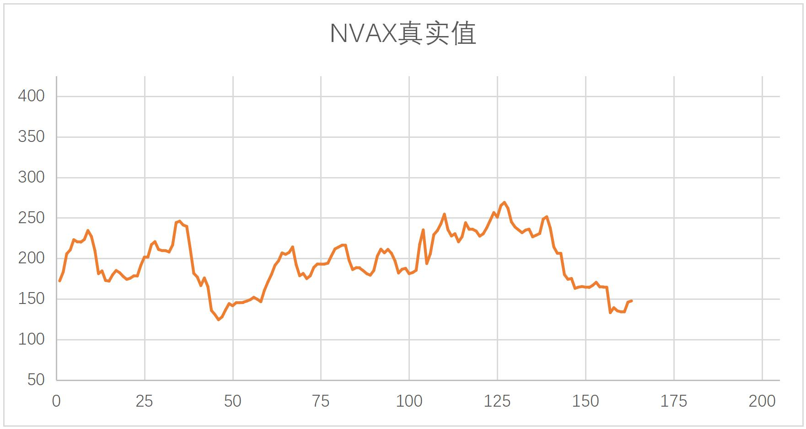
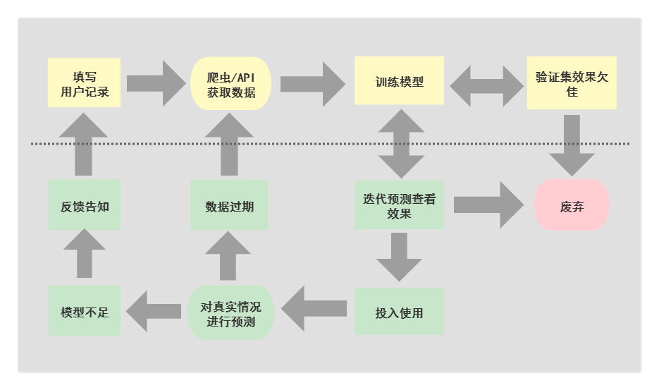
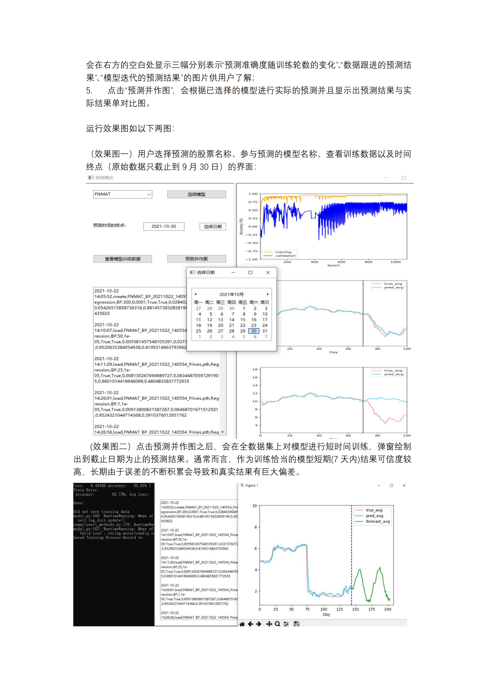

## 这是什么？
这是HITsz2020-2021大一年度项目，我们的选题为《基于机器学习的股票预测和分析》。

事实上，这一项目核心是我们深度学习入门和对工程性项目完整流程的尝试。在这两点上，这一项目达到了它创建之初的目的。本项目的主体分为两部分，一个是GUI的实现，一个是各模型算法的实现。

二者之间的衔接，使用Config类将需要的参数全部封装以供GUI部分对各模型进行调用。
> 学习了此处的封装策略 [https://github.com/hichenway/stock_predict_with_LSTM/blob/master/main.py](https://github.com/hichenway/stock_predict_with_LSTM/blob/master/main.py)

GUI部分由zh, wyl完成，各模型代码由本人负责实现，yzx负责项目前期的爬虫编写，后期对项目流程的初步梳理，以及与我对模型进行调整修改。
## 这个项目能做什么？
我们认为我们的模型能在适当的训练方式下对于大部分股票走势做到较好的学习，即使对于少数股票会出现和趋势恰好相反的情形，我们认为这一点完全可以在更深入的分析模型来解决。

对于影响因素复杂的股票价格，使用单一的神经网络模型利用历史数据进行预测是具有一定的可行性的，表明了股票在受到多种因素影响的情况下，也在时间维度上存在一定的规律可寻。

Normalization方向对模型权值学习的影响是巨大的，而我们所选取的非常规的数据标准化方式能避免潜在的数据泄露问题，也使得能方便的迁移到迭代式预测的数据处理中。

迭代预测和跟进预测的结合使用能一定程度上排除不合格的模型。解决的典型问题是模型只学习到倾向于把前一天的价格作为当天的输出而呈现滞后，而即使是正确的模型也会因为幅度问题导致预测滞后。此时迭代预测能初步判断模型学习到的函数是否正确。

## 项目介绍
### 项目结果展示
图为NVAX结果（更多结果展示，查看readme_fig文件夹）

### 项目总体结构
对于框架代码部分，GUI框架代码使用wxPython库，对于库的选择没有专门讨论。GUI代码是整个项目的总模块，用于对其他各部分进行调用、组织。GUI框架代码共计910行，总代码共计2144行。

对于数据获取部分，由于YahooFinance是动态网页，动态网页的爬取目前只了解到有selenium库，一个主要的缺点是速度较慢和对网络环境要求高。对于股票数据更新，将原爬虫搜索部分修改为调取官方api，因有准确的股票名可以方便的处理；仅在搜索官方缩写未知的股票时调取爬虫，提高运行效率。

对于数据处理及分析部分，数据处理方式直接影响模型的学习效果，Normalization方向和策略的影响。对于这类序列结果，常见的欠拟合和过拟合结果逐渐熟悉，熟悉了部分调参和经典深度学习优化方法的使用。对结果可靠性进行了分析，得到了少量可靠性较高的模型，对于一些有趣的现象增加了研究兴趣。

### 本项目执行过程中的局限
1. 对于个人开发者的使用部分，不完全支持GUI界面，对源代码和控制台有依赖；
2. 数据源对网络要求较高，无论是用api还是调用爬虫，均需要较好的网络条件
3. 对于模型细节分析具体的方式未明朗， 对于一般的图像处理能通过Saliency Map等方式来对模型学习效果进行解释，但对于股票预测，让人对人自己并不能做到的事情来评价它的结果就显得比较困难。
4. 原定的分类模型废弃，考虑可能是对上涨下跌过于武断的分类会导致模型学习失败，尚处于研究过程中。

### 论文参考文献

[1] 7forz. 2019. 使用 lstm 预测时间序列. https://www.7forz.com/3319/.

[2] Jimmy Lei Ba, Jamie Ryan Kiros, and Geoffrey E. Hinton. 2016. Layer normalization.

[3] Sergey Ioffe and Christian Szegedy. 2015. Batch normalization: Accelerating deep network training by reducing internal covariate shift.

[4] Yuxin Wu and Kaiming He. 2018. Group normalization.

[5] 张锋. 2015. 一文搞懂 hmm（隐马尔可夫模型）. https://www.cnblogs.com/skyme/p/4651331.html.

[6] 程序员一一涤生. 2020. 用 python 做时间序列预测四：平稳/非平稳时间序列. https://cloud.tencent.com/developer/article/1638198.

[7] 肥宅_Sean. 2018. Lstm 实现股票预测. https://blog.csdn.net/a19990412/article/details/85139058.

### 项目论文 - 部分截图

### 用户手册 - 部分截图

